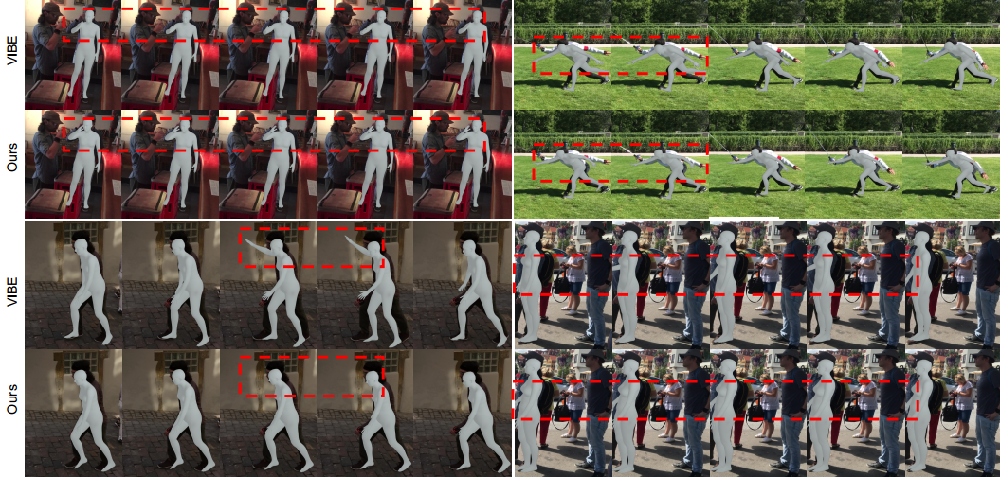

## Exploring Versatile Prior for Human Motion via Motion Frequency Guidance

**This is the codebase for video-based human motion reconstruction in [human-motion-prior](https://github.com/JchenXu/human-motion-prior).**

<p>  </p>

[\[Video Demo\]](https://youtu.be/MLmCq0f-RP8) [\[Paper\]](https://arxiv.org/pdf/2111.13074.pdf)

## Installation
Requirements
- Python 3.6 
- PyTorch 1.1.0 

Because this project is based on our pretrained [human motion prior](https://github.com/JchenXu/human-motion-prior), please clone the prior repository and this repository as follows:
```bash
git clone https://github.com/JchenXu/human-motion-prior.git human_motion_prior                                                                                          
git clone https://github.com/JchenXu/motion-prior-reconstruction.git
```

and run the following command to install the dependencies:
```bash
pip install -r requirements.txt
```

## Data Preparation

Please download the required data (i.e., our pre-trained prior model and SMPL model parameters) [here](https://drive.google.com/file/d/12LAlvHJ34qNkOqCVawSDjBquQH6MI2Ma/view?usp=sharing), and then, uncompress and put it in data/mp_data.

Then, refer to [this](https://github.com/JchenXu/motion-prior-reconstruction/blob/master/assets/data.md) for data generation, and put all data files in data/mp_db. 

The whole data directory is like:
```
motion-prior-reconstruction/data
├── mp_data
│   ├── ...
|   └── ...
|
├── mp_db
    ├── 3dpw_train_db.pt
    └── insta_train_db.h5
    └── ...
```

## Training
Run the commands below to start training:

```bash
export PYTHONPATH=../human_motion_prior
python train.py --cfg configs/config_3dpw.yaml
```


## Evaluation
Modify the trained checkpoint in configs to evaluation your trained model. Then, run the commands below to start evaluation:

```bash
export PYTHONPATH=../human_motion_prior
python eval.py --cfg configs/config_3dpw.yaml
```

Also, we provide our pre-trained checkpoint [here](https://drive.google.com/file/d/1tbbCd09SmnFHO9IefmDV-Lfm1fi_ZaZI/view?usp=sharing).


## Citation

```bibtex
@inproceedings{human_motion_prior,
  title = {Exploring Versatile Prior for Human Motion via Motion Frequency Guidance},
  author = {Jiachen Xu, Min Wang, Jingyu Gong, Wentao Liu, Chen Qian, Yuan Xie, Lizhuang Ma},
  booktitle = {2021 international conference on 3D vision (3DV)},
  year = {2021}
}
```

## Acknowledgement
We thank the authors of [VIBE](https://github.com/mkocabas/VIBE) for their released code, and this base codes are largely borrowed from them.
