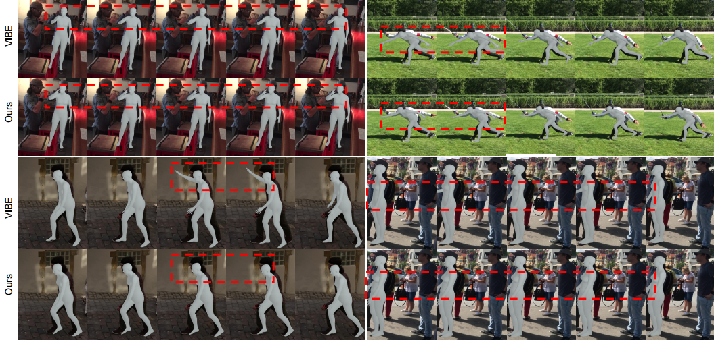

## Exploring Versatile Prior for Human Motion via Motion Frequency Guidance

**This is the codebase for video-based human motion reconstruction in [human-motion-prior](https://github.com/JchenXu/human-motion-prior).**

<p>  </p>

[\[Video Demo\]](https://youtu.be/MLmCq0f-RP8) [\[Paper\]](https://arxiv.org/pdf/2111.13074.pdf)

## Installation
Requirements
- Python 3.6 
- PyTorch 1.1.0 

Because this project is based on our pretrained [human motion prior](https://github.com/JchenXu/human-motion-prior), please clone the prior repository and this repository as follows:
```bash
git clone https://github.com/JchenXu/human-motion-prior.git
git clone https://github.com/JchenXu/motion-prior-reconstruction.git
```

and run the following command to install the dependencies:
```bash
pip install -r requirements.txt
```

## Data Preparation

We have prepared a nice demo code to run VIBE on arbitrary videos. 
First, you need download the required data(i.e our trained model and SMPL model parameters). To do this you can just run:

```bash
source scripts/prepare_data.sh
```

## Training
Run the commands below to start training:

```shell script
source scripts/prepare_training_data.sh
python train.py --cfg configs/config.yaml
```

Note that the training datasets should be downloaded and prepared before running data processing script.
Please see [`doc/train.md`](doc/train.md) for details on how to prepare them.
 
## Evaluation

Here we compare VIBE with recent state-of-the-art methods on 3D pose estimation datasets. Evaluation metric is
Procrustes Aligned Mean Per Joint Position Error (PA-MPJPE) in mm.

| Models         | 3DPW &#8595; | MPI-INF-3DHP &#8595; | H36M &#8595; |
|----------------|:----:|:------------:|:----:|
| SPIN           | 59.2 |     67.5     | **41.1** |
| Temporal HMR   | 76.7 |     89.8     | 56.8 |
| VIBE           | 56.5 |     **63.4**     | 41.5 |

See [`doc/eval.md`](doc/eval.md) to reproduce the results in this table or 
evaluate a pretrained model.

**Correction**: Due to a mistake in dataset preprocessing, VIBE trained with 3DPW results in Table 1 of the original paper are not correct.
Besides, even though training with 3DPW guarantees better quantitative performance, it does not give good 
qualitative results. ArXiv version will be updated with the corrected results. 

## Citation

```bibtex
@inproceedings{kocabas2019vibe,
  title={VIBE: Video Inference for Human Body Pose and Shape Estimation},
  author={Kocabas, Muhammed and Athanasiou, Nikos and Black, Michael J.},
  booktitle = {The IEEE Conference on Computer Vision and Pattern Recognition (CVPR)},
  month = {June},
  year = {2020}
}
```

## License
This code is available for **non-commercial scientific research purposes** as defined in the [LICENSE file](LICENSE). By downloading and using this code you agree to the terms in the [LICENSE](LICENSE). Third-party datasets and software are subject to their respective licenses.


## References
We indicate if a function or script is borrowed externally inside each file. Here are some great resources we 
benefit:

- Pretrained HMR and some functions are borrowed from [SPIN](https://github.com/nkolot/SPIN).
- SMPL models and layer is from [SMPL-X model](https://github.com/vchoutas/smplx).
- Some functions are borrowed from [Temporal HMR](https://github.com/akanazawa/human_dynamics).
- Some functions are borrowed from [HMR-pytorch](https://github.com/MandyMo/pytorch_HMR).
- Some functions are borrowed from [Kornia](https://github.com/kornia/kornia).
- Pose tracker is from [STAF](https://github.com/soulslicer/openpose/tree/staf).


